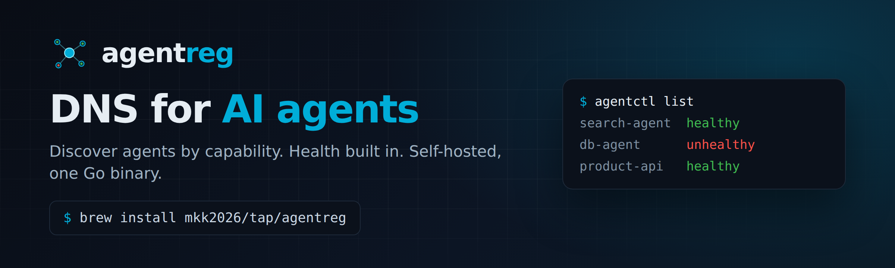

<p align="center">
  
</p>

<p align="center">
  <b>DNS for AI agents.</b><br>
  A self-hosted registry that lets your agents find each other by capability — with health and trust built in.
</p>

<p align="center">
  <a href="https://github.com/mkk2026/agentreg/releases"></a>
  <a href="LICENSE"></a>
  
  
  
  
</p>

---

Everyone is building AI agents. Nobody is building the layer that lets agents
**exist alongside each other** — discovery, health, trust. The moment you run
more than a couple of MCP servers, you're hardcoding endpoints in config files,
finding out an agent is down only when something breaks, and trusting every
endpoint blindly.

MCP gave agents a common language. `agentreg` gives them a place to find each
other.

> **Consul tells you *where* a service is. `agentreg` tells you *what* an agent
> can do, *whether* it's healthy, and (soon) *how much to trust it*.**

One Go binary. Self-hosted. No cloud, no account, no cluster. Runs on your
laptop at 3 agents and scales with you.

## Install

```bash
# Homebrew (macOS / Linux)
brew install mkk2026/tap/agentreg

# or download a binary from the latest release
#   https://github.com/mkk2026/agentreg/releases

# or from source (Go 1.26+)
go install github.com/mkk2026/agentreg@latest
```

## Quickstart

```bash
# 1. run the registry
agentctl serve &

# 2. register your agents
agentctl register search-agent -c search     -e http://localhost:3000
agentctl register db-agent     -c db-read     -e http://localhost:3001
agentctl register product-api  -c api,email   -e http://localhost:3002

# 3. see everything, with live health
agentctl list

# 4. discover by capability — use this in your agent's startup instead of a hardcoded URL
agentctl find search
agentctl find search --format json
```

`agentctl list`:

```
NAME          CAPABILITIES  STATUS     SOURCE  LAST HEARTBEAT  ENDPOINT
db-agent      db-read       unhealthy  local   just now        http://localhost:3001
product-api   api,email     healthy    local   just now        http://localhost:3002
search-agent  search        healthy    local   just now        http://localhost:3000
```

The daemon health-checks every registered agent on an interval, so a down agent
shows up as `unhealthy` **before** it breaks something downstream. That's the
difference between reading a status table and debugging a production incident
backwards.

## Why agentreg

- **Capability-first discovery.** Ask for what you need (`find search`), not
  where it lives. Endpoints move; capabilities don't.
- **Health built in.** Every agent is probed on a heartbeat. No separate
  monitoring stack to wire up.
- **Self-hosted, zero cloud.** One static binary. Your registry, your data,
  your network. Nothing leaves your machine.
- **Delightful at 3 agents, load-bearing at 30.** Cheap enough to adopt before
  you need it, so it's already there when you do.
- **Built to grow into trust.** The verification layer is pluggable from day one
  (see [Roadmap](#roadmap)).

## How it works

```
  agentctl (CLI)  ──HTTP──▶  agentreg daemon
                                  │
                                  ├── Store     in-memory + atomic JSON persistence
                                  └── Verifier  health probe, on a heartbeat loop
```

Two design seams make the roadmap additive instead of a rewrite:

- **`Source` field** on every record (`local` today; `peer:<id>`, `from:ans`,
  `from:mcp_registry` later) so federation and cross-registry ingestion don't
  require a migration.
- **`Verifier` interface** — v1 ships a health probe; ANS-identity,
  prompt-injection, and `tools/list` verifiers plug into the same seam.
- **`labels`** — optional operator metadata (`env`, `team`, `version`, …) that
  rides along on every record and shows up in `list`. Set it via the API today:

  ```bash
  curl -X POST http://localhost:8080/agents -H 'Content-Type: application/json' \
    -d '{"name":"corebrim-search","capabilities":["search"],
         "endpoint":"http://10.0.0.12:3000",
         "labels":{"env":"prod","team":"platform","version":"1.4.2"}}'
  ```

## agentreg vs. the alternatives

|                                   | **agentreg** | MCP Registry | Consul | ANS (IETF) |
|-----------------------------------|:---:|:---:|:---:|:---:|
| Self-hosted, no cloud dependency  | ✅ | ❌ (cloud) | ✅ | ~ (ref impl) |
| Capability-based discovery        | ✅ | ✅ | ~ (tags) | ✅ |
| Health checks built in            | ✅ | ❌ | ✅ | ❌ |
| Single binary, 30-second setup    | ✅ | n/a | ❌ (cluster) | ❌ |
| Cross-org trust / verification    | 🔜 (pluggable) | ❌ | ❌ | ✅ (spec) |
| Purpose-built for agents/MCP      | ✅ | ✅ | ❌ | ✅ |

`agentreg` isn't trying to out-spec the standards bodies — it's the tool
developers actually run, built to interoperate with them.

## HTTP API

| Method | Path | Purpose |
|--------|------|---------|
| `POST` | `/agents` | register an agent (JSON body) |
| `GET`  | `/agents` | list all agents |
| `GET`  | `/agents/find?capability=X` | find by capability |
| `POST` | `/agents/{name}/heartbeat` | agent self-reports healthy |
| `GET`  | `/healthz` | daemon liveness |

## Configuration

```
agentctl serve
  --port 8080                        # listen port
  --store ~/.agentreg/registry.json  # persistence file
  --heartbeat-interval 15s           # how often to health-check agents
  --probe-timeout 3s                 # per-agent probe timeout
```

## Roadmap

`agentreg` ships as the smallest lovable loop first, then grows toward being the
trust fabric agents rely on.

- **v0.1 — the loop (now).** register · list · find · heartbeat, single binary.
- **Next — trust.** Pluggable verifiers: ANS identity, `tools/list` validation,
  prompt-injection checks. Verification-as-a-service.
- **Next — federation.** `agentctl federate` across registries; the `Source`
  field lights up.
- **Later — the fabric.** One client that discovers and verifies across every
  registry (ANS, MCP Registry, local), so agents transact across org boundaries
  safely.

Delightful extras on the list: a live `list` TUI, `agentctl doctor`,
`agentctl graph`, and zero-config auto-register from an MCP manifest.

## Contributing

Early days, and help is welcome. Open an issue to discuss a change, or send a PR.

```bash
git clone https://github.com/mkk2026/agentreg
cd agentreg
go test ./...
go build -o agentctl .
```

## License

[MIT](LICENSE) © Core Brim Tech

---

<p align="center"><sub>Built by <a href="https://github.com/mkk2026">Core Brim Tech</a> · agents deserve a substrate.</sub></p>
